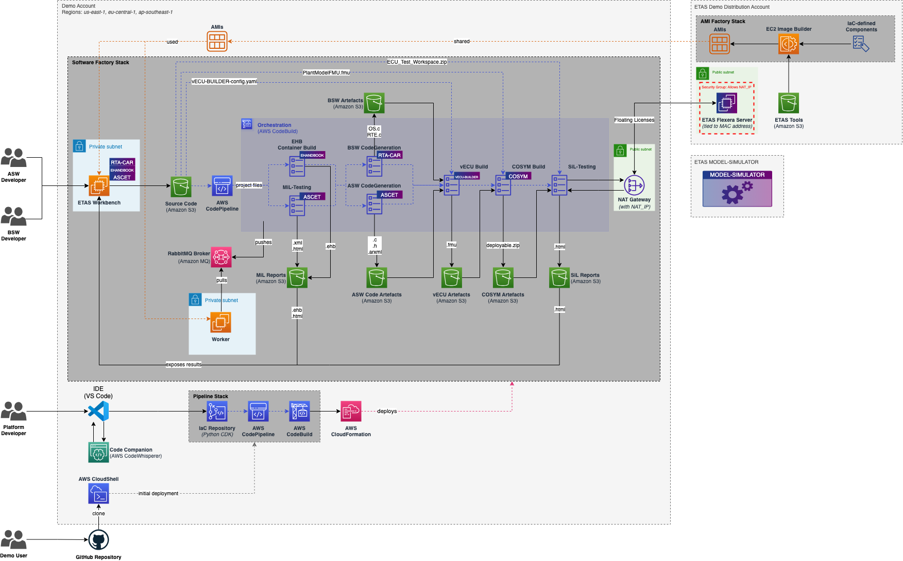
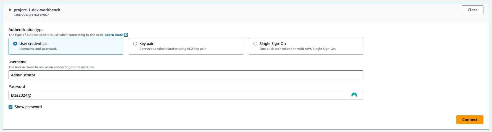
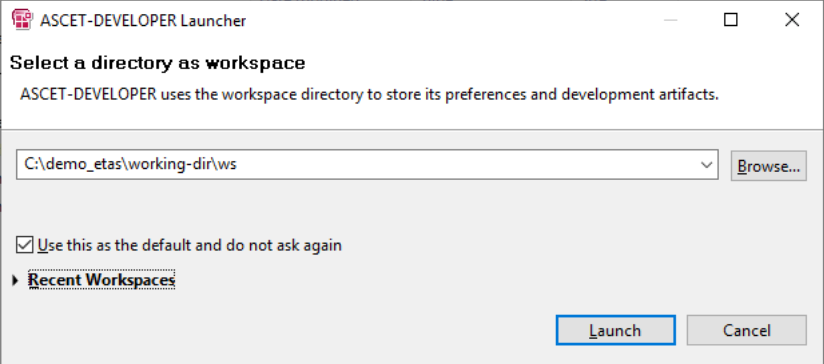
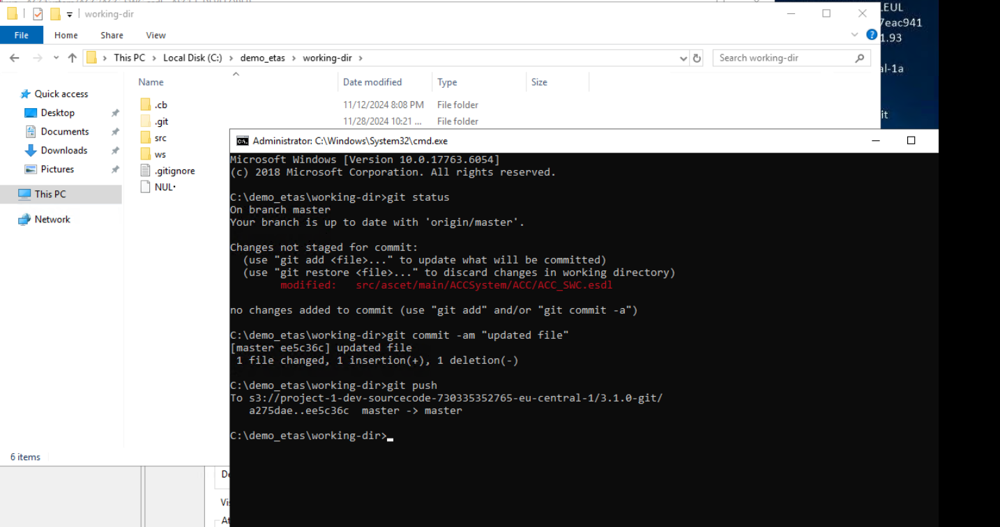
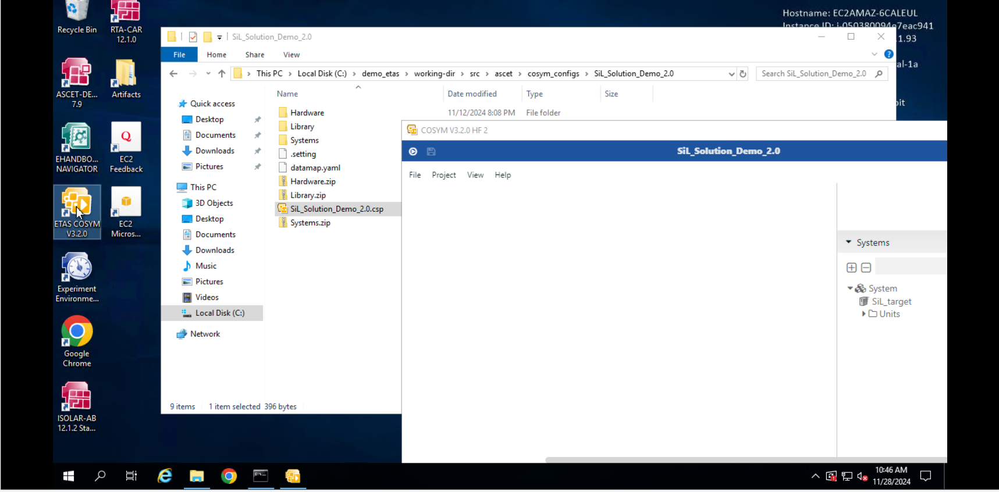
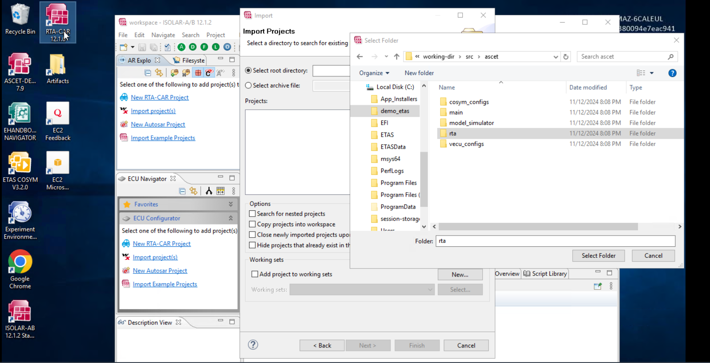
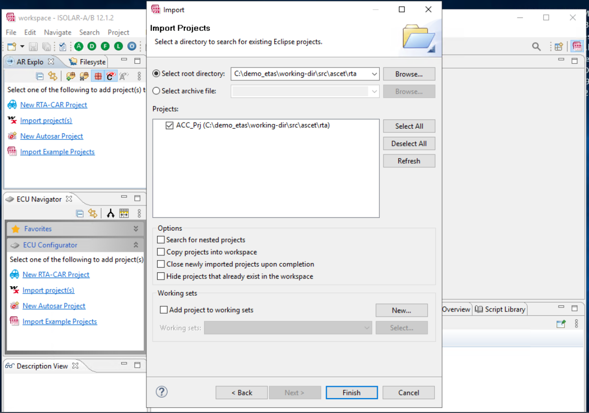

# Model-based design workflow for AUTOSAR Classic Platform

Welcome to our demo showcasing how to design and test an in-vehicle application on AWS using a model-based approach. With our specially crafted Workbench, you can easily connect via a web browser-based client and access all the tools you need, including ETAS ASCET-DEVELOPER and ETAS EHANDBOOK-NAVIGATOR. 

Before committing your code, you can locally execute and test your application at the model level to ensure everything is working as expected. Once you're ready, our project pipeline will be triggered, running a comprehensive suite of model-in-the-loop (MiL) tests at scale. If the MiL tests pass successfully, C code will be generated, including the Application Software (ASW) and Basic Software (BSW) components. 

Next, the code will be fed into ETAS vECU-BUILDER, which will produce a model of the virtual Electronic Control Unit (vECU) in FMU format. This model, known as a Type-2 vECU model, will then be bundled with the Plant Model FMU using ETAS COSYM. 

To ensure the quality of your software, software-in-the-loop (SiL) tests will be executed at scale using ETAS MODEL SIMULATOR, with test specifications designed with TraceTronic ecu.test. The results of both the MiL and SiL tests will be available for analysis on the Workbench, allowing you to close the loop and make any necessary adjustments. 

Our architecture can be easily configured and deployed using infrastructure-as-code (IaC) based on CDK and Python. This means that anyone with an AWS account can test and benefit from this powerful workflow. 

Join us and experience the future of in-vehicle application development with ETAS on AWS!

This demo aligns AWS' efforts in revolutionizing automotive software development with ETAS' [Continuous Development Workbench](https://www.etas.com/en/products/continuous-development-workbench.php).

## Architecture



## Deploy

If you got here from the [main page](../../README.md), resume your [CloudShell session](https://console.aws.amazon.com/cloudshell/home#). Otherwise, please refer to the main [Getting Started](../../README.md#getting-started) section, and come back here. It will only take a few minutes.

Issue the following commands:

```sh
cd ~/asdw
./scripts/deploy etas-autosar-cp
```

The `deploy` script will take about **1 minute** to complete and will print the AWS account ID and NAT gateway address


With the above information, request access to the assets and licenses filling [**this form**](https://www.etas.com/en/portfolio/registration-continuous-development-workbench.php). ETAS will provide you access to the required tools free of charge.

When you have been granted access from ETAS, you will need to rerun the `deploy` script:

```sh
cd ~/asdw
git pull
./scripts/deploy etas-autosar-cp
```

This second `deploy` run will take about **18 minutes**. Afterwards, please allow another **10 minutes** before accessing the workbench, then click the link printed by `deploy`:


and connect using with the following credentials:

Username: `Administrator`

Password: `Etas2024@`



The above step relies on Fleet Manager, a capability of [AWS Systems Manager](https://docs.aws.amazon.com/systems-manager/latest/userguide/what-is-systems-manager.html), to connect to your workbench using the Remote Desktop Protocol (RDP). [Fleet Manager Remote Desktop](https://docs.aws.amazon.com/systems-manager/latest/userguide/fleet-rdp.html), which is powered by NICE DCV, provides a secure connectivity to a Windows Server instance directly from the Systems Manager console.

You're good to go!

## Demo Walkthrough 

1. To get started, once on the desktop, open ASCET_DEVELOPER and set the default workspace as `C:\demo_etas\working-dir\ws`.



2. Restore the Project Explorer.


3. Navigate to `ACCSystem/ACC/ACC_SWD.bd/Main/compute` and click the `Relative_Velocity_Gain` element. Change the Default Value from **0.4** to **5**. This will make the MiL-Testing stage of the pipeline fail, stopping the execution of the following stages of the pipeline, thus saving resources.


4. Save your modifications.

5. Push your modifications to git repository initialised in remote S3 bucket.  Open 'cmd' prompt at `C:\demo_etas\working-dir` folder and do the following git commands to commit and push chnages to git-remote-S3 bucket associated with the project. This will trigger the pipeline execution.

[](./docs/step5.png) 

6. In the AWS Console, navigate to AWS CodePipeline, open the **project-1-dev** pipeline and you will be able to follow its execution.

7. Back on the desktop, you can also open the **Artefacts** shortcut to have a look at the artefacts generated by the pipeline. They are indexed by commit ID. Under `<COMMIT_ID>/mil-tests` you will find an `index.html` file. Right-click it and open it with Google Chrome to see the results of the failed Model-In-the-Loop tests.

8. You can now start again from step **2.** by putting back the `Relative_Velocity_Gain` Default Value to **0.4**. This will result in a successful execution of the pipeline until the SiL tests, whose results can be found again directly on the desktop under the **Artefacts** shortcut. 

## COSYM and RTA-CAR project workspaes

1. On the desktop, double-click and open the **ETAS COSYM V3.2.0**, navigate to `C:\demo_etas\working-dir\src\ascet\cosym_configs\SiL_Solution_Demo_2.0\SiL_Solution_Demo_2.0.csp`. Now cosym project workspaces gets launched.



2. Back on the desktop, double-click and open the **RTA-CAR 12.1.0**, navigate to `C:\demo_etas\working-dir\src\ascet\rta`. Now RTA-CAR project workspaces gets launched.





## Demo Video 

Here is the re:Invent 2023 official demo video with comments on the end-to-end workflow. The underlying example (Speed Controller) is simpler than the Adaptice Cruise Controller (ACC) featured in this example. As you will not be using the Virtual Engineering Workbench, the relevant part starts at 1:40.

[](https://www.youtube.com/watch?v=8cUedpXNTbY&ab_channel=AmazonWebServices)


## Why do we use S3 for source code management?

We have made some exciting updates to our setup to enhance the deployment process and ensure a smoother experience for you. Instead of using the AWS Code Commit git system, we have switched to a more convenient solution - AWS S3. Now, we use an S3 bucket to synchronize the workspace between the workbench and the worker instances. This S3 bucket also acts as a versioning system, making it easy for you to keep track of different versions of your code. These changes have been implemented to simplify the deployment process and make it seamlessly integrated within the AWS ecosystem. For more information, please take a look at the architecture diagram provided above.

## Looking to Save Costs on the Demo?

We've got you covered! The biggest cost factor of this demo is the usage of EC2 instances for the Workbench and the Worker. To optimize costs when you're not actively working on the demo, you can choose to stop and start the instances at your convenience. Simply follow the steps outlined in the [AWS documentation](https://docs.aws.amazon.com/AWSEC2/latest/UserGuide/Stop_Start.html#starting-stopping-instances).

## Tools Details

- [ETAS ASCET-DEVELOPER](https://www.etas.com/en/products/ascet-developer.php) is a professional development tool that can be used to model functions and generate C code based on graphic models and text-based programming notations. ETAS ASCET-DEVELOPER allows you to efficiently develop high-performance, easy-to-maintain, secure application software for embedded systems.

- [ETAS EHANDBOOK](https://www.etas.com/en/products/ehandbook.php) is an award-winning solution that combines multiple document files from different development sources into an easy-to-use, interactive format. ETAS EHANDBOOK saves you valuable time by understanding complex ECU applications faster.

- [ETAS VECU-BUILDER](https://www.etas.com/en/products/vecu-builder.php) is a tool for the generation of virtual ECUs as FMU for the verification and validation of automotive microcontroller software in Software-in-Loop (SIL) setups. ETAS VECU-Builder allows you to generate stand-alone, executable virtual ECUs for comprehensive cooperation with OEMs and suppliers.

- [ETAS COSYM](https://www.etas.com/en/products/cosym-co-simulation-platform.php) is a powerful simulation and integration platform for testing and validating software in all phases of software development. ETAS COSYM helps to reduce costs and time by moving HiL tests forward to virtual simulation (MiL/SiL).

- [ETAS MODEL-SIMULATOR](https://www.etas.com/en/applications/software-in-the-loop-testing-in-the-cloud.php) is a platform for parallel simulation, test execution and driving cycle generation. Allowing you to significantly increase the simulation speed, receive fast feedback and detect errors at an early stage – all while maintaining data security in according to ISO 27001.
 

- [ETAS RTA-CAR](https://www.etas.com/en/products/rta_software_products.php) includes basic software modules and tools for the development of ECU software.

## Cleanup

From [CloudFormation](https://console.aws.amazon.com/cloudformation/home) delete `project-1-dev-software-factory` stack.

You will also need to manually empty and delete the `project-1-dev-<ACCOUNT_ID>-<REGION>` Amazon S3 bucket and few Cloudwatch log groups. 