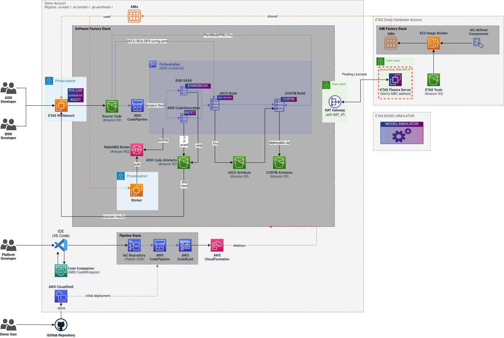

# Model-based design workflow for Digital Auto Platform

This blueprint showcases how to design and test and virtual ECU that later gets integrated into the [digital.auto](https://www.digital.auto/) platform. 
With our specially crafted Workbench, you can easily connect via a web browser-based client and access all the tools you need, including ETAS ASCET-DEVELOPER and ETAS EHANDBOOK-NAVIGATOR.

Before committing your code, you can locally execute and test your application at the model level to ensure everything is working as expected. Once you're ready, our project pipeline will be triggered, including the Application Software (ASW) and EHANDBOOK creation via SaaS call. 

Next, the code will be fed into ETAS vECU-BUILDER, which will produce a model of the virtual Electronic Control Unit (vECU) in FMU format. This model, will be tested with ETAS COSYM.

Finally, the code will be integrated into the [digital.auto](https://www.digital.auto/) platform, where you can test it in a virtual car environment.

## Architecture

